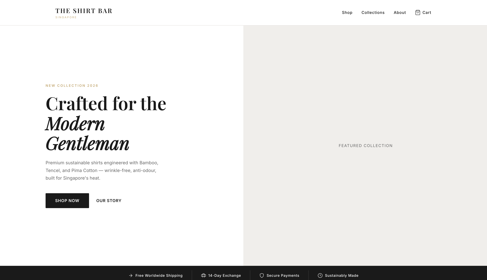
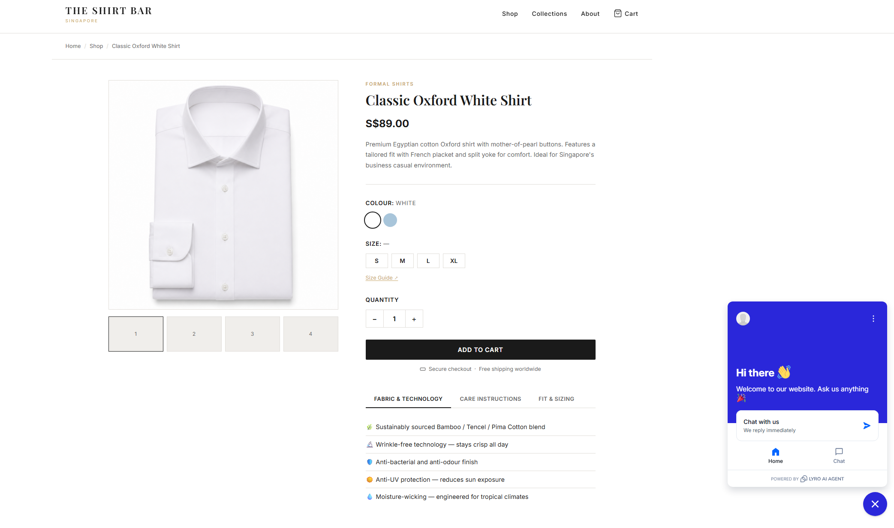
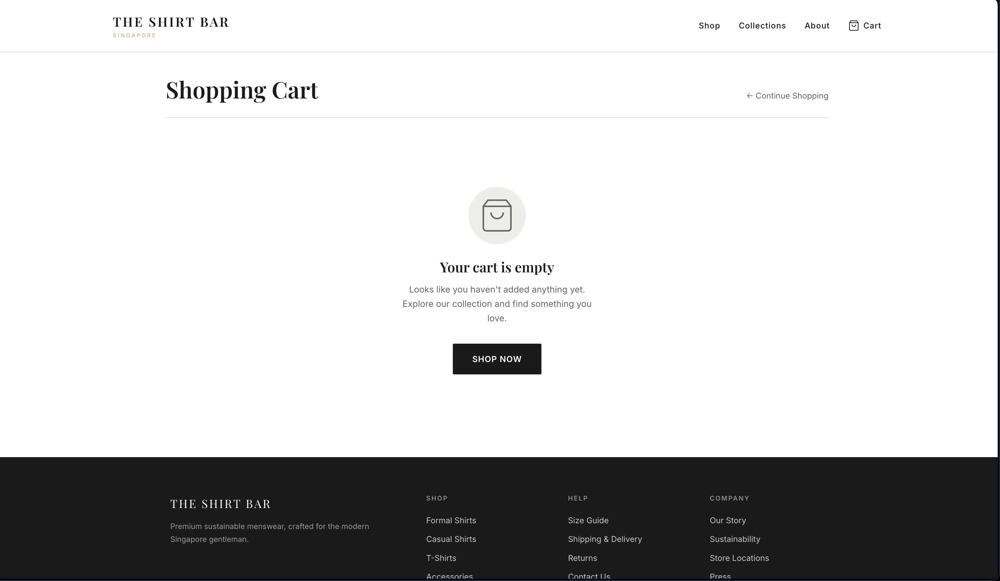

[](https://github.com/AnarkeyV/capstone/actions/workflows/deploy.yml)
[](https://www.python.org/)
[](https://flask.palletsprojects.com/)
[](https://www.docker.com/)
[](https://azure.microsoft.com/)
[](https://www.terraform.io/)
[](https://kubernetes.io/)
[](#staging-monitoring-and-canary-update)

# 🛍️ The Shirt Bar — Cloud-Native E-Commerce Capstone Project

A cloud-native e-commerce platform for **The Shirt Bar**, a premium sustainable menswear brand based in Singapore.

This project demonstrates how a Flask-based online shop can be containerised with Docker, pushed to Azure Container Registry, deployed to Azure Kubernetes Service, prepared with Azure SQL Database support, automated through GitHub Actions, and extended with Terraform-managed staging infrastructure, monitoring assets, and canary deployment testing.

---

## 📋 Table of Contents

- [Current Project Status](#current-project-status)
- [Live Deployment Evidence](#live-deployment-evidence)
- [Staging, Monitoring, and Canary Update](#staging-monitoring-and-canary-update)
- [Project Overview](#project-overview)
- [Key Features](#key-features)
- [Architecture](#architecture)
- [Tech Stack](#tech-stack)
- [Azure Resources](#azure-resources)
- [Application Routes](#application-routes)
- [Local Development](#local-development)
- [Automated Testing](#automated-testing)
- [Docker Build and Local Test](#docker-build-and-local-test)
- [Docker Platform Note for AKS](#docker-platform-note-for-aks)
- [Terraform Staging Infrastructure](#terraform-staging-infrastructure)
- [Kubernetes Deployment](#kubernetes-deployment)
- [Canary Deployment Strategy](#canary-deployment-strategy)
- [Monitoring Dashboard Package](#monitoring-dashboard-package)
- [GitHub Actions CI/CD](#github-actions-cicd)
- [Azure SQL Databases](#azure-sql-databases)
- [Release Rehearsal Result](#release-rehearsal-result)
- [Cost Control](#cost-control)
- [Known Limitation: Azure Public IP Quota](#known-limitation-azure-public-ip-quota)
- [Project Structure](#project-structure)
- [DevOps and Cloud Skills Demonstrated](#devops-and-cloud-skills-demonstrated)
- [Future Improvements](#future-improvements)
- [Team Handover Notes](#team-handover-notes)

---

## ✅ Current Project Status

The project has completed the original release rehearsal and has now been extended with a tested staging infrastructure and canary deployment branch.

| Area | Status |
|---|---|
| Flask e-commerce application | Completed |
| Docker container build | Completed |
| Azure Container Registry image push | Completed |
| AKS deployment | Completed |
| Route testing with pytest | Completed |
| Release rehearsal | Passed |
| Terraform-managed staging infrastructure | Tested successfully |
| Staging AKS deployment | Tested successfully |
| Product image loading in staging | Verified |
| Canary deployment strategy | Tested successfully |
| Monitoring dashboard package | Added |
| Branch status | Merged/ready to be documented from `main` after merge |

---

## 🌐 Live Deployment Evidence

The full shop application was successfully deployed and tested on **Azure Kubernetes Service (AKS)**.

| Item | Value |
|---|---|
| **Previous AKS Image** | `capstonereg047af007.azurecr.io/ecommerce-app:v23` |
| **Latest Tested Staging Image** | `capstonereg047af007.azurecr.io/ecommerce-app:v24` |
| **AKS Service** | `capstone-service` |
| **Deployment** | `capstone-app` |
| **Previous Public Test IP** | `http://20.184.58.23` |
| **Current Staging Access Method** | `kubectl port-forward` |
| **Final Result** | Full shop and staging deployment verified successfully |

> **Cost and quota note:** AKS may be stopped outside testing/demo periods to reduce Azure cost. In the latest staging branch, services were tested using `ClusterIP` and `kubectl port-forward` because the Azure subscription reached the public IP limit in Southeast Asia.

### ✅ Verified Routes

| Route | Result | Purpose |
|---|---:|---|
| `/` | `200 OK` | Shop homepage and product listing |
| `/health` | `200 OK` | Kubernetes health check |
| `/product/TSHIRT-001` | `200 OK` | Product detail page |
| `/cart` | `200 OK` | Shopping cart page |

---

## 📸 Screenshots

Screenshots were captured during the successful AKS deployment test.

### Homepage



### Product Detail Page



### Cart Page



> These screenshots show that the deployed application was reachable through AKS and that the main shop pages loaded successfully.

---

## 🚀 Staging, Monitoring, and Canary Update

The latest project extension added a tested staging environment, monitoring assets, and canary deployment strategy.

The work was completed in the branch:

```text
infra-staging-monitoring-canary
```

### Completed work

| Update | Description |
|---|---|
| Terraform staging infrastructure | Added infrastructure-as-code plan for staging |
| Kubernetes staged environments | Added Kubernetes configuration for staged deployment |
| Canary deployment strategy | Added and tested a canary deployment approach |
| Monitoring dashboard package | Added monitoring documentation/assets package |
| Supported AKS node size | Updated staging node VM size to a supported option |
| Kubernetes manifests | Updated manifests for Terraform-managed staging AKS |
| Staging image update | Updated staging deployment to image `v24` |
| ClusterIP testing | Updated canary service for `ClusterIP` testing |

### Tested result

- Terraform created the staging infrastructure successfully.
- The staging app worked on AKS through port-forward.
- Product images loaded correctly.
- The canary deployment strategy was tested successfully.
- Automated tests passed.
- The branch was clean and ready for PR review before merging.

### Important staging access note

The latest staging service uses:

```yaml
type: ClusterIP
```

instead of:

```yaml
type: LoadBalancer
```

This is because the Azure subscription reached the public IP limit in the Southeast Asia region.

Use port-forwarding to test the staging app:

```bash
kubectl port-forward service/<service-name> 8080:<service-port>
```

Example:

```bash
kubectl port-forward service/capstone-service 8080:80
```

Then open:

```text
http://localhost:8080
```

---

## 📖 Project Overview

The Shirt Bar e-commerce application was built as a practical cloud deployment project.

The project focuses on:

- Building a Flask e-commerce web app
- Containerising the application using Docker
- Storing application images in Azure Container Registry
- Deploying to Azure Kubernetes Service
- Using Kubernetes health probes
- Preparing Azure SQL databases for product and order data
- Automating release deployment through GitHub Actions
- Creating Terraform-managed staging infrastructure
- Testing Kubernetes staged environments
- Testing a canary deployment strategy
- Adding monitoring dashboard documentation/assets
- Documenting release rehearsal and handover steps
- Applying cost-control practices by stopping AKS after testing

---

## ✨ Key Features

| Feature | Description |
|---|---|
| **Product Listing** | Homepage displays The Shirt Bar product collection |
| **Product Detail Page** | Individual product pages using SKU routes |
| **Shopping Cart** | Cart page and add-to-cart route structure |
| **Flask Blueprints** | Routes split into product, cart, and checkout modules |
| **Health Endpoint** | `/health` route supports Kubernetes probes |
| **Dockerised App** | Flask app packaged into a production container |
| **ACR Integration** | Docker images pushed to Azure Container Registry |
| **AKS Deployment** | App deployed through Kubernetes Deployment and Service YAML |
| **Terraform Staging** | Staging infrastructure managed through Terraform |
| **Canary Deployment** | Safer deployment strategy tested using Kubernetes resources |
| **Monitoring Package** | Monitoring dashboard package added for operational visibility |
| **CI/CD Workflow** | GitHub Actions builds, tests, pushes, and deploys the app |
| **Release Runbook** | Handover and release rehearsal documented for team use |

---

## 🏗️ Architecture

```text
┌──────────────────┐
│ Local Developer  │
│ VS Code + Git    │
└────────┬─────────┘
         │ git push / pull request
         ▼
┌──────────────────┐
│ GitHub Repo      │
│ main branch      │
└────────┬─────────┘
         │ triggers
         ▼
┌──────────────────┐
│ GitHub Actions   │
│ CI/CD Pipeline   │
└────────┬─────────┘
         │ tests + docker build + push
         ▼
┌────────────────────────────┐
│ Azure Container Registry   │
│ ecommerce-app:vXX          │
└────────┬───────────────────┘
         │ image pull
         ▼
┌────────────────────────────┐
│ Azure Kubernetes Service   │
│ Deployment: capstone-app   │
│ Service: capstone-service  │
└────────┬───────────────────┘
         │ LoadBalancer or ClusterIP
         ▼
┌────────────────────────────┐
│ The Shirt Bar Web App      │
│ Flask + Jinja2 + CSS       │
└────────────────────────────┘
```

### Staging and canary extension

```text
┌────────────────────────────┐
│ Terraform                  │
│ Staging Infrastructure     │
└────────┬───────────────────┘
         │ creates/updates
         ▼
┌────────────────────────────┐
│ AKS Staging Environment    │
│ Kubernetes Manifests       │
└────────┬───────────────────┘
         │ deploys
         ▼
┌────────────────────────────┐
│ Stable App + Canary App    │
│ Tested with ClusterIP      │
└────────┬───────────────────┘
         │ port-forward
         ▼
┌────────────────────────────┐
│ Local Browser Test         │
│ http://localhost:8080      │
└────────────────────────────┘
```

---

## 🛠️ Tech Stack

| Area | Technology |
|---|---|
| Backend | Python, Flask |
| Frontend | HTML, CSS, Jinja2 Templates |
| Database | Azure SQL Database |
| Containerisation | Docker |
| Container Registry | Azure Container Registry |
| Orchestration | Azure Kubernetes Service |
| Infrastructure as Code | Terraform |
| CI/CD | GitHub Actions |
| Deployment | Kubernetes YAML |
| Monitoring | Monitoring dashboard package |
| Cloud Platform | Microsoft Azure |
| Payment Integration | Stripe Test Mode |
| Documentation | Markdown, Runbooks, Playbooks |

---

## ☁️ Azure Resources

| Resource Type | Name |
|---|---|
| Resource Group | `rg-capstone` |
| AKS Cluster | `capstone-aks` |
| Azure Container Registry | `capstonereg047af007` |
| ACR Login Server | `capstonereg047af007.azurecr.io` |
| Kubernetes Deployment | `capstone-app` |
| Kubernetes Service | `capstone-service` |
| Previous Public Service IP | `20.184.58.23` |
| Current Staging Service Type | `ClusterIP` |
| Product Database | `tsb-products-db` |
| Orders Database | `tsb-orders-db` |

> Resource names may differ in Terraform-managed staging if separate staging-specific names are used in the Terraform files.

---

## 📡 Application Routes

| Route | Method | Description |
|---|---|---|
| `/` | `GET` | Main shop homepage and product listing |
| `/product/<sku>` | `GET` | Product detail page |
| `/cart` | `GET` | Shopping cart page |
| `/cart/add/<sku>` | `POST` | Add selected product to cart |
| `/health` | `GET` | Health endpoint for Kubernetes probes |

The `/health` route was added so Kubernetes liveness and readiness probes can confirm that the Flask application is running correctly.

Example health response:

```json
{
  "status": "ok"
}
```

---

## 💻 Local Development

### Prerequisites

- Python 3.10+
- Git
- Docker Desktop
- Azure CLI
- kubectl
- Terraform

### 1. Clone the repository

```bash
git clone https://github.com/AnarkeyV/capstone.git
cd capstone
```

### 2. Create a virtual environment

```bash
python3 -m venv .venv
```

### 3. Activate the virtual environment

```bash
source .venv/bin/activate
```

### 4. Install dependencies

```bash
pip install -r app/requirements.txt
```

### 5. Run the Flask app locally

```bash
python app/app.py
```

Local Flask URL:

```text
http://localhost:5001
```

---

## ✅ Automated Testing

Automated route tests were added using `pytest`.

The test files are located in:

```text
tests/
├── conftest.py
└── test_app_routes.py
```

The current tests validate that these key routes load successfully:

| Test | Route | Expected |
|---|---|---|
| Health check | `/health` | `200 OK` and `{"status": "ok"}` |
| Homepage | `/` | `200 OK` and The Shirt Bar content |
| Product detail page | `/product/TSHIRT-001` | `200 OK` and product content |
| Cart page | `/cart` | `200 OK` and cart content |

Run tests locally:

```bash
python -m pytest
```

Expected output:

```text
4 passed
```

These tests are also executed inside the GitHub Actions pipeline before the Docker image is built and pushed.

---

## 🐳 Docker Build and Local Test

The Dockerfile is located at:

```text
app/Dockerfile
```

The Docker image must be built from the repository root because the Dockerfile copies files from the `app/` directory.

### Build the Docker image

```bash
docker build -t shirtbar-shop-test:latest -f app/Dockerfile .
```

### Run the container locally

```bash
docker run --rm -p 5002:8000 shirtbar-shop-test:latest
```

### Test the container

```bash
curl -i http://localhost:5002/
curl -i http://localhost:5002/health
curl -i http://localhost:5002/product/TSHIRT-001
curl -i http://localhost:5002/cart
```

Expected result:

```text
HTTP/1.1 200 OK
```

---

## 🧱 Docker Platform Note for AKS

When building from a Mac, the image may default to an ARM platform. AKS requires a Linux AMD64-compatible image.

The working command used for AKS was:

```bash
docker buildx build --platform linux/amd64 \
  -t capstonereg047af007.azurecr.io/ecommerce-app:v24 \
  -f app/Dockerfile . \
  --push
```

This avoids the `ImagePullBackOff` issue caused by a platform mismatch.

---

## 🏗️ Terraform Staging Infrastructure

Terraform was added to support a managed staging infrastructure plan.

### Typical Terraform workflow

Go to the Terraform directory used in the project:

```bash
cd terraform
```

or:

```bash
cd infra
```

Then run:

```bash
terraform init
terraform validate
terraform plan
terraform apply
```

When prompted by `terraform apply`, type:

```text
yes
```

### Verified staging result

Terraform successfully created the staging infrastructure used for AKS testing.

### Terraform reminders

- Always run `terraform plan` before `terraform apply`.
- Do not commit local Terraform state files if they are not meant to be stored in Git.
- Confirm the correct Azure subscription before applying infrastructure changes.
- Destroy unused test infrastructure only when the team agrees it is no longer needed.

---

## ☸️ Kubernetes Deployment

Kubernetes files are located in:

```text
kubernetes/
├── deployment.yaml
├── service.yaml
└── canary/
```

> The exact folder names may differ depending on the final merged project structure.

Useful commands:

```bash
kubectl get deployments
kubectl get pods
kubectl get svc
kubectl describe deployment capstone-app
```

Check the deployed image:

```bash
kubectl describe deployment capstone-app | grep Image
```

Check services:

```bash
kubectl get svc
```

### Port-forward access for ClusterIP service

If the service type is `ClusterIP`, use port-forwarding:

```bash
kubectl port-forward service/capstone-service 8080:80
```

Then open:

```text
http://localhost:8080
```

---

## 🐤 Canary Deployment Strategy

A canary deployment is a safer way to test a new version of the application before fully replacing the stable version.

In this project, the canary deployment strategy was tested successfully in the staging environment.

### Why canary deployment is useful

Instead of immediately sending all users to a new version, a canary deployment allows the team to:

- Deploy a new version beside the stable version
- Test the new version in a controlled way
- Verify routes, product pages, cart pages, and images
- Reduce the risk of releasing broken changes
- Roll back more safely if something fails

### Useful canary checks

```bash
kubectl get deployments
kubectl get pods
kubectl get svc
kubectl rollout status deployment/<deployment-name>
```

Example:

```bash
kubectl rollout status deployment/capstone-app
```

### Manual browser checks

After port-forwarding, check:

```text
http://localhost:8080/
http://localhost:8080/health
http://localhost:8080/product/TSHIRT-001
http://localhost:8080/cart
```

Expected result:

```text
200 OK
```

---

## 📊 Monitoring Dashboard Package

A monitoring dashboard package was added to support operational visibility.

The monitoring package helps the team document and prepare monitoring for:

- Application health
- Deployment status
- AKS workload visibility
- Staging environment checks
- Evidence collection for demos and handover

Typical monitoring evidence should include:

- Pod status
- Deployment status
- Service status
- Application route checks
- Screenshots of successful app access
- Any dashboard screenshots or exported dashboard files

---

## 🔄 GitHub Actions CI/CD

The workflow file is located at:

```text
.github/workflows/deploy.yml
```

The CI/CD workflow performs:

1. Checkout code
2. Set up Python
3. Install dependencies
4. Run pytest route tests
5. Login to Azure Container Registry
6. Build Docker image for Linux AMD64
7. Push Docker image to ACR
8. Set AKS context
9. Apply Kubernetes deployment and service files
10. Wait for rollout status

Important Docker build command:

```bash
docker build --platform linux/amd64 \
  -t ${{ secrets.ACR_LOGIN_SERVER }}/ecommerce-app:v${{ github.run_number }} \
  -f app/Dockerfile .
```

The final `.` is important because the Docker build context must be the repository root.

### Required GitHub Secrets

| Secret | Purpose |
|---|---|
| `ACR_LOGIN_SERVER` | Azure Container Registry login server |
| `ACR_USERNAME` | ACR username |
| `ACR_PASSWORD` | ACR password |
| `KUBERNETES_KUBECONFIG` | AKS kubeconfig for deployment |

> The AKS cluster must be running before the GitHub Actions deployment step can reach the Kubernetes API server.

---

## ⚠️ Important CI/CD Note: AKS Must Be Running for Deployment

The GitHub Actions workflow has two major parts:

1. **CI checks** — install dependencies, run tests, build the Docker image, and push the image to ACR.
2. **CD deployment** — connect to AKS and apply the Kubernetes deployment.

If AKS is intentionally stopped for cost control, the CI stages can still pass, but the Kubernetes deployment stage may fail because GitHub Actions cannot reach the AKS API server.

This does **not** necessarily mean the code, tests, Docker image, or pipeline build is broken.

Expected situation when AKS is stopped:

| Pipeline Stage | Expected Result |
|---|---|
| Install Dependencies & Run Tests | Pass |
| Build and Push Docker Image | Pass |
| Set AKS Context | May pass |
| Deploy to Kubernetes Cluster | May fail because AKS is stopped |

To run a fully green deployment pipeline:

```bash
az aks start --resource-group rg-capstone --name capstone-aks
```

Confirm AKS is running:

```bash
az aks show --resource-group rg-capstone --name capstone-aks --query "powerState.code" -o tsv
```

Expected output:

```text
Running
```

Then re-run the GitHub Actions workflow.

After the team has finished verification or demo testing, stop AKS again:

```bash
az aks stop --resource-group rg-capstone --name capstone-aks
```

---

## 🗄️ Azure SQL Databases

The project includes Azure SQL setup for product and order data.

| Database | Purpose |
|---|---|
| `tsb-products-db` | Product and category data |
| `tsb-orders-db` | Orders and order item data |

Database scripts and setup helpers are stored in:

```text
database/
```

---

## ✅ Release Rehearsal Result

A release rehearsal was completed as part of the handover process.

Final successful result:

- Docker image fixed to serve the full Flask shop app
- `/health` endpoint added for Kubernetes probes
- AKS successfully pulled and ran image `v23`
- Public LoadBalancer service returned `200 OK`
- Homepage loaded successfully
- Product detail page loaded successfully
- Cart page loaded successfully
- AKS was stopped after testing for cost control
- Release runbook was updated and merged

The release rehearsal runbook is documented in:

```text
documentation/phase2_release_rehearsal_handover_runbook.md
```

---

## 💰 Cost Control

To reduce Azure cost, AKS can be stopped when not actively testing or demonstrating.

### Stop AKS

```bash
az aks stop --resource-group rg-capstone --name capstone-aks
```

### Check AKS power state

```bash
az aks show --resource-group rg-capstone --name capstone-aks --query "powerState.code" -o tsv
```

Expected output when stopped:

```text
Stopped
```

### Start AKS before deployment or demo

```bash
az aks start --resource-group rg-capstone --name capstone-aks
```

Expected output when running:

```text
Running
```

---

## ⚠️ Known Limitation: Azure Public IP Quota

During staging testing, the service was changed to `ClusterIP` instead of `LoadBalancer`.

### Reason

The Azure subscription reached the public IP limit in the Southeast Asia region.

### Impact

AKS cannot provision another external public IP address for a new LoadBalancer service until quota is increased or unused public IPs are removed.

### Current workaround

Use:

```bash
kubectl port-forward service/capstone-service 8080:80
```

Then open:

```text
http://localhost:8080
```

### Future options

- Request a public IP quota increase in Azure.
- Delete unused public IP addresses.
- Reuse an existing public IP where appropriate.
- Use an ingress controller when a suitable public IP is available.
- Continue using `ClusterIP` for internal staging validation.

---

## 📁 Project Structure

```text
capstone/
├── app/
│   ├── app.py
│   ├── Dockerfile
│   ├── requirements.txt
│   ├── routes/
│   ├── models/
│   ├── templates/
│   └── static/
├── database/
│   ├── generate_aeo.py
│   └── init_db.py
├── documentation/
│   ├── phase2_release_rehearsal_handover_runbook.md
│   └── monitoring/
├── infra/
│   └── terraform files / staging infrastructure files
├── kubernetes/
│   ├── deployment.yaml
│   ├── service.yaml
│   └── canary deployment files
├── tests/
│   ├── conftest.py
│   └── test_app_routes.py
├── .github/
│   └── workflows/
│       └── deploy.yml
└── README.md
```

> Folder names should be adjusted if the final merged branch uses `terraform/` instead of `infra/`, or a different folder name for canary and monitoring files.

---

## 📈 DevOps and Cloud Skills Demonstrated

| Skill Area | Tools / Practices |
|---|---|
| Version Control | Git, GitHub, pull requests, branch cleanup |
| CI/CD | GitHub Actions pipeline |
| Automated Testing | pytest route tests |
| Containerisation | Docker, Dockerfile, image tagging |
| Cloud Registry | Azure Container Registry |
| Kubernetes | AKS, Deployment, Service, probes, rollout status |
| Infrastructure as Code | Terraform staging infrastructure |
| Deployment Strategy | Canary deployment testing |
| Monitoring | Monitoring dashboard package and operational checks |
| Cloud Database | Azure SQL Database |
| Troubleshooting | ImagePullBackOff, Docker build context, platform mismatch, public IP quota |
| Release Management | Release rehearsal, runbook, handover notes |
| Cost Awareness | AKS stop/start and Azure cost control |

---

## 🔮 Future Improvements

- Add more automated unit and integration tests
- Add product image uploads and storage using Azure Blob Storage
- Add HTTPS ingress with a custom domain
- Add production-ready monitoring dashboards for AKS and application metrics
- Add Terraform remote state management
- Separate development, staging, and production environments more clearly
- Add automated canary promotion and rollback
- Add blue-green deployment strategy as a comparison
- Add Azure Key Vault for secrets management
- Add database migration workflow for Azure SQL

---

## 👥 Team Handover Notes

Before running a deployment demo:

1. Start AKS.
2. Confirm the cluster is running.
3. Re-run the GitHub Actions workflow or push a new commit to `main`.
4. Confirm the pod is `1/1 Running`.
5. Test `/`, `/health`, `/product/TSHIRT-001`, and `/cart`.
6. If the service is `ClusterIP`, use `kubectl port-forward`.
7. Confirm product images load correctly.
8. Capture screenshots as evidence.
9. Stop AKS after testing to reduce cost.

### After merging the staging/canary branch into `main`

1. Switch back to `main` locally:

```bash
git checkout main
```

2. Pull the latest merged changes:

```bash
git pull origin main
```

3. Confirm the working tree is clean:

```bash
git status
```

4. Delete the merged local branch safely:

```bash
git branch -d infra-staging-monitoring-canary
```

5. Prepare the final team playbook from the updated `main` branch.

---

## 📄 License

This project was created for a DevOps / Cloud Support capstone project.

---

Built as part of DevOps and Cloud Support Engineering training.

Last updated: June 2026
