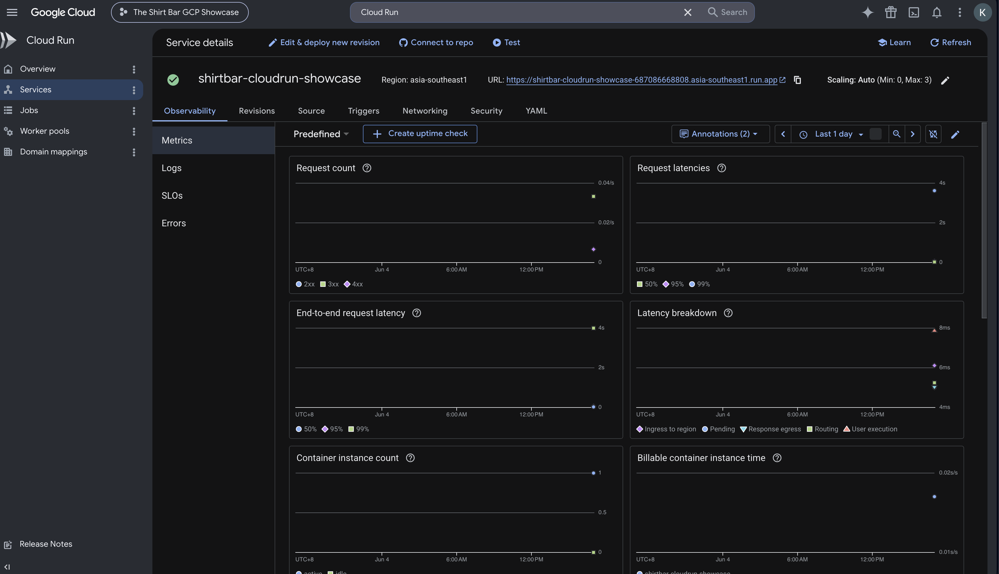
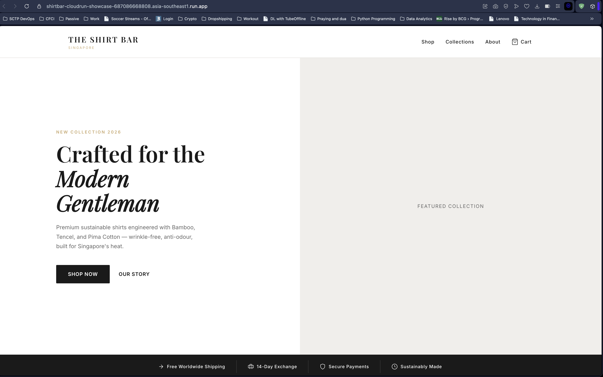
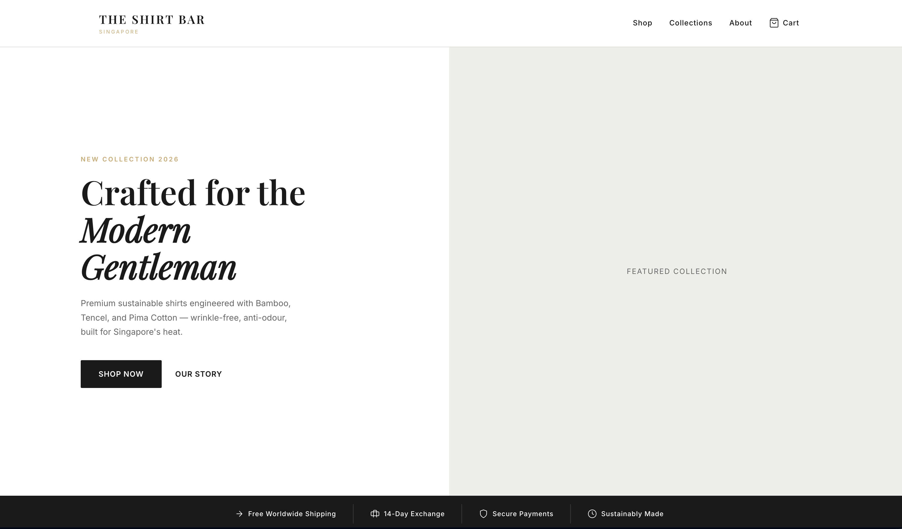
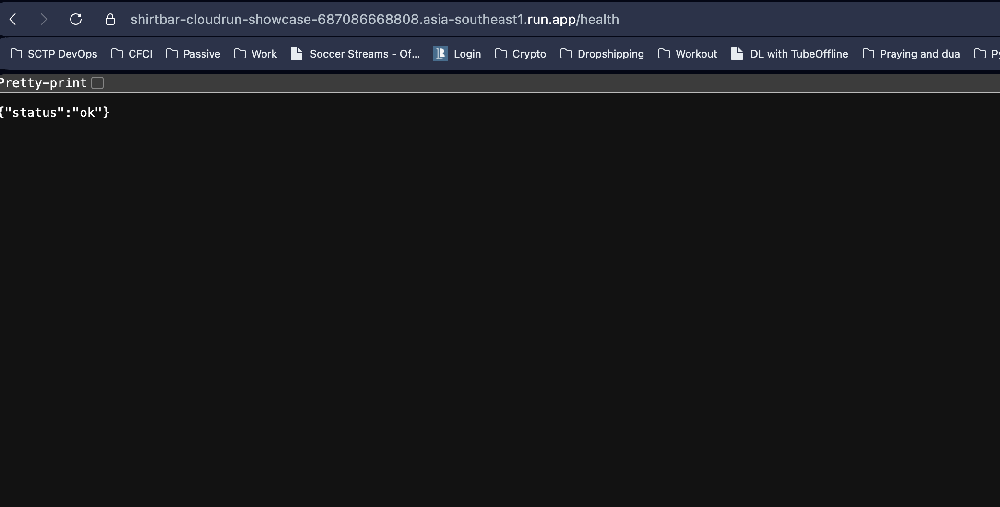
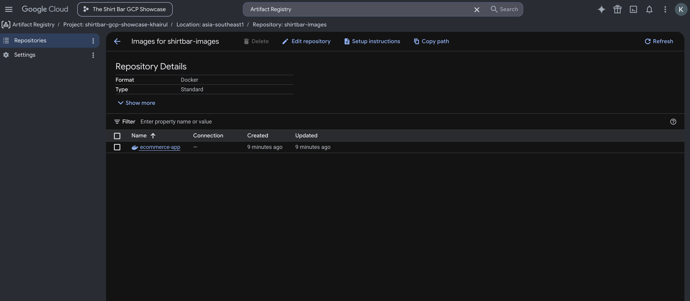
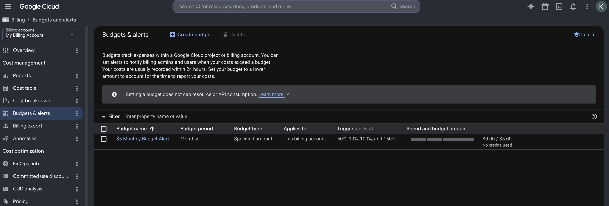

# GCP Cloud Run Backup-Cloud Showcase

## Purpose

The main deployment for this capstone project is hosted on Microsoft Azure using Azure Kubernetes Service, Azure Container Registry, Terraform, Kubernetes, and GitHub Actions.

As an additional cloud showcase, the same Dockerised Flask e-commerce application was deployed to Google Cloud Run. This demonstrates multi-cloud portability without changing the main Azure architecture.

This GCP deployment is not intended to replace the Azure deployment. It is a backup-cloud proof of concept to show that the application can run on another cloud provider because it is packaged as a Docker container.

## Services Used

- Google Cloud Project: The Shirt Bar GCP Showcase
- Google Artifact Registry: Stores the Docker image
- Google Cloud Run: Runs the containerised Flask application
- Google Cloud Billing Budget Alert: Provides cost-control evidence

## Deployment Summary

1. Created a separate Google Cloud project for the showcase.
2. Linked the project to an active billing account.
3. Created a small budget alert for cost control.
4. Installed and configured the Google Cloud CLI.
5. Enabled the required GCP services:
   - Cloud Run
   - Artifact Registry
   - Cloud Build
6. Created an Artifact Registry Docker repository.
7. Built and pushed the Flask application Docker image to Artifact Registry.
8. Deployed the image to Cloud Run.
9. Tested the homepage, product page, cart page, and health route.
10. Captured screenshots as evidence.
11. Deleted the Cloud Run service after evidence was captured to reduce unnecessary cost.

## Evidence Screenshots

### Cloud Run Service Page

### Cloud Run Public URL

### The Shirt Bar Homepage on Cloud Run

### Health Route

### Artifact Registry Docker Image

### Budget Alert

## Important Note

This GCP deployment is a backup-cloud proof of concept, not a full disaster recovery system.

A complete disaster recovery setup would also require:

- Database replication
- DNS failover
- Secrets management
- Monitoring and alerting
- Recovery Time Objective planning
- Recovery Point Objective planning
- Automated failover testing

## Presentation Explanation

Our main production-style deployment is on Azure AKS. As a separate backup-cloud showcase, we deployed the same Dockerised Flask application to Google Cloud Run.

This demonstrates multi-cloud portability because the application is packaged as a Docker container and can run outside Azure with minimal changes.

We did not fully duplicate the Azure architecture in GCP because that would require rebuilding Kubernetes, database, storage, IAM, monitoring, and Terraform in another cloud platform. Instead, this Cloud Run proof of concept provides a simple and clear way to show that the application is portable across cloud providers.