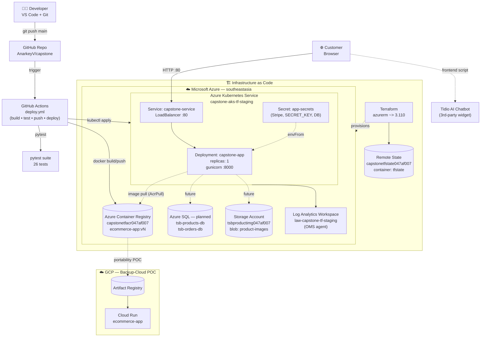
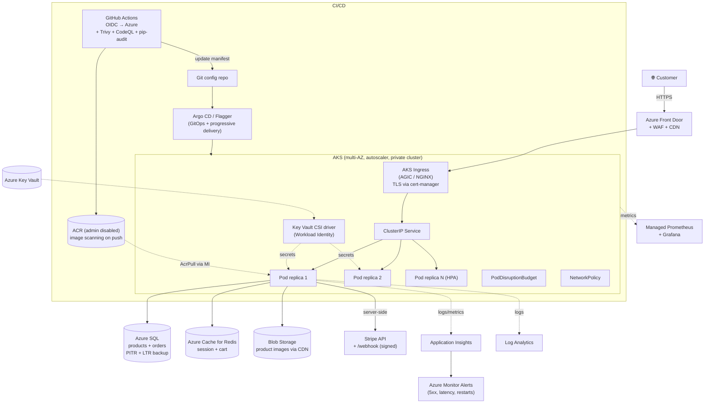

# 🧪 Sanity Check — The Shirt Bar Capstone

**Date:** 2026-06-08
**Scope:** Production-readiness review of the repository (app, container, Kubernetes, Terraform, CI/CD, security, observability).
**Verdict:** ✅ Excellent **capstone / academic** deliverable. ❌ **Not production-ready** for a real public e-commerce store handling real money or PII without the hardening below.

---

## 1. High-Level Architecture (HLD)

### 1.1 Current deployed architecture



### 1.2 Recommended target (production) architecture



---

## 2. Critical Findings (must fix before going live)

| # | Severity | Area | Issue | Where | Suggested fix |
|---|---|---|---|---|---|
| 1 | 🔴 | Data | Cart & orders stored only in Flask cookie `session`; Azure SQL is "planned" not wired. Orders lost on pod restart. | `app/routes/checkout_routes.py`, `app/routes/cart_routes.py` | Persist orders to Azure SQL via the existing `app/models/` layer. |
| 2 | 🔴 | Security | `SECRET_KEY` silently defaults to `"dev-secret-key"`. | `app/app.py:11`, `app/config.py:7` | `raise RuntimeError` if unset outside dev. |
| 3 | 🔴 | Payments | No Stripe **webhook signature verification**. `/success` can be hit directly without paying. | `checkout_routes.py:119` | Add `/webhook` using `stripe.Webhook.construct_event`; persist orders only on `checkout.session.completed`. |
| 4 | 🔴 | Hygiene | Public cluster IP committed: `external-ip.txt = 20.184.58.23`. | repo root | Delete file + add to `.gitignore`. |
| 5 | 🔴 | Security | ACR `admin_enabled = true` → long-lived shared creds in GitHub Secrets. | `terraform/main.tf:45` | Disable admin; use AKS managed identity (already has AcrPull) + GitHub **OIDC** for CI. |
| 6 | 🔴 | CI/CD | Workflow uses `ACR_USERNAME`/`ACR_PASSWORD` and a stored kubeconfig. | `.github/workflows/deploy.yml` | `azure/login@v2` with OIDC, `az aks get-credentials`. Rotate all current secrets. |
| 7 | 🔴 | Availability | `replicas: 1`, no PDB, no HPA → downtime on every deploy/node drain. | `kubernetes/deployment.yaml:8` | `replicas: 2+`, add `PodDisruptionBudget`, `HorizontalPodAutoscaler`. |
| 8 | 🔴 | Network | `Service: LoadBalancer :80` — no TLS, no Ingress, no WAF. | `kubernetes/service.yaml` | NGINX/AGIC Ingress + cert-manager (Let's Encrypt) **or** Azure Front Door + WAF. Force HTTPS. |
| 9 | 🔴 | Security | `except Exception as e` returns raw `str(e)` to the user. | `checkout_routes.py:111` | Log via `current_app.logger`; return generic message. |
| 10 | 🔴 | Storage | Product images container is public-blob with `allow_nested_items_to_be_public = true`. | `terraform/main.tf:122,130` | OK for images, but lock down naming + front with CDN; never reuse for sensitive data. |

## 3. High-Priority Improvements

- **Secrets management:** Adopt Azure Key Vault + CSI Secrets Store driver with Workload Identity. Stop storing app secrets as raw K8s `Secret`.
- **Image security:** Add Trivy / Defender for Containers scan in CI; generate SBOM (`docker buildx --sbom=true` or Syft); enable image signing (cosign).
- **Code security:** Add CodeQL, Bandit, pip-audit, Dependabot/Renovate.
- **`requirements.txt`:** Several versions look fabricated/future-dated (`certifi==2026.4.22`, `requests==2.34.2`, `MarkupSafe==3.0.3`). Verify against PyPI; use `pip-compile` for a hash-pinned lockfile.
- **Dockerfile:** Multi-stage build, numeric `USER` UID, add `HEALTHCHECK`.
- **Pod hardening:** `securityContext: { runAsNonRoot: true, readOnlyRootFilesystem: true, allowPrivilegeEscalation: false, capabilities: { drop: ["ALL"] }, seccompProfile: { type: RuntimeDefault } }`.
- **K8s posture:** Add NetworkPolicies, namespaces per env, ResourceQuotas, LimitRanges.
- **Probes:** Split `/healthz` (liveness, cheap) vs `/readyz` (checks DB + Stripe reachability).
- **Gunicorn:** Tune `--workers`, `--timeout`, `--keep-alive`, `--access-logfile -`; derive workers from CPU.
- **Logging:** Structured JSON logs to stdout for Log Analytics ingestion.
- **CSRF & rate limiting:** Flask-WTF for CSRF on POSTs; Flask-Limiter or Front Door rate limits.
- **Sessions:** Move from Flask client-side cookies to server-side store (Redis) for cart integrity.

## 4. Medium-Priority Improvements

- Split Terraform into reusable **modules** (`network`, `aks`, `acr`, `sql`, `storage`); add `tflint` + `checkov` + `terraform validate` to CI.
- Verify Terraform **state locking** is enabled on the blob backend (lease).
- AKS: ≥2 nodes across availability zones, enable **cluster autoscaler**, consider **private cluster** + Azure CNI + Azure RBAC.
- **Backup/DR:** Azure SQL PITR + LTR; Velero for AKS state; geo-redundant ACR.
- **Observability:** Add Application Insights instrumentation, managed Prometheus + Grafana, SLOs and alerts (5xx ratio, latency, pod restarts, node NotReady).
- **Testing:** Add load tests (k6/Locust), accessibility (axe), Lighthouse.
- **Compliance:** Privacy policy, cookie banner, GDPR/PDPA data-retention controls.
- **Pipeline drift:** Jenkinsfile + Azure Pipelines + GitHub Actions all coexist — pick one canonical pipeline.

## 5. Nice-to-Have

- Pre-commit hooks (`black`, `ruff`, `isort`, `yamllint`).
- Architecture Decision Records (`docs/adr/`).
- GitOps with **Argo CD / Flux**, progressive delivery with **Argo Rollouts / Flagger**.
- Tag images with **git SHA** alongside `v${run_number}` for traceability.
- Feature flags via Azure App Configuration.

## 6. What's already strong ✅

- Clean Flask Blueprint structure; 26 passing pytest tests.
- Non-root container user.
- Resource requests/limits set on the pod.
- Terraform with remote backend + `AcrPull` role assignment.
- Canary + Blue-Green manifests and promote/rollback scripts.
- Multi-cloud portability POC (GCP Cloud Run).
- Excellent README, handover notes, monitoring KQL queries.

---

## 7. Can it be tested locally? ✅ Yes

Three independent local test paths work without any cloud resources.

### 7.1 Run unit/integration tests (fastest)
```bash
python3 -m venv .venv && source .venv/bin/activate
pip install -r app/requirements.txt
python -m pytest -v
```
> ⚠️ `pyodbc` may fail to install on macOS/Linux without the **Microsoft ODBC Driver 18** + `unixodbc`. Install via Homebrew (`brew tap microsoft/mssql-release && brew install msodbcsql18 unixodbc`) **or** temporarily comment `pyodbc` out of `requirements.txt` — the current routes don't actually hit SQL.

### 7.2 Run the Flask app directly
```bash
cp .env.example .env          # then edit SECRET_KEY and Stripe test keys
source .venv/bin/activate
python app/app.py             # serves on http://localhost:5001
```
Smoke-test routes:
```bash
curl http://localhost:5001/health
curl http://localhost:5001/
curl http://localhost:5001/product/TSHIRT-001
```

### 7.3 Run the full container locally (closest to prod)
```bash
docker build --platform linux/amd64 -t tsb-local:dev -f app/Dockerfile .
docker run --rm -p 8000:8000 --env-file .env tsb-local:dev
# http://localhost:8000  →  gunicorn
```

### 7.4 Optional: full K8s rehearsal with kind/minikube
```bash
kind create cluster --name tsb
kind load docker-image tsb-local:dev --name tsb
# Edit kubernetes/deployment.yaml image to tsb-local:dev temporarily
kubectl create secret generic app-secrets --from-env-file=.env
kubectl apply -f kubernetes/deployment.yaml -f kubernetes/service.yaml
kubectl port-forward svc/capstone-service 8080:80
```

### Local-test caveats
| Component | Local? | Notes |
|---|---|---|
| Flask app + routes | ✅ | Fully works. |
| pytest suite | ✅ | 26 tests, no cloud deps. |
| Docker image | ✅ | Builds and runs. |
| Stripe checkout | ⚠️ | Use **test keys**; success/cancel URLs must be reachable (use `ngrok` for webhook test). |
| Tidio chatbot | ✅ | Frontend widget loads from CDN. |
| Azure SQL | ❌ | Not actually used in code paths today. |
| AKS / ACR / LB | ❌ | Use `kind`/`minikube` to rehearse manifests locally. |
| Terraform | 🟡 | `terraform validate` / `plan` work locally; `apply` needs Azure credentials. |

---

## 8. Suggested minimum path to "production-ready v1"

1. Remove `external-ip.txt`; disable ACR admin; migrate CI to OIDC.
2. Fail-fast on missing `SECRET_KEY`; wire Key Vault + CSI driver.
3. Implement Stripe **webhook**; persist orders to Azure SQL.
4. Add Ingress + TLS (cert-manager) + WAF; drop the bare LoadBalancer.
5. `replicas: 2`, PDB, HPA, pod SecurityContext, NetworkPolicy.
6. Split `/healthz` vs `/readyz`; add Application Insights.
7. Add CodeQL + Trivy + pip-audit + Dependabot; fix `requirements.txt` pins.
8. Add CSRF protection and a Redis-backed session store.

---

*Generated as a pre-production sanity check. Treat each row in §2 as a release blocker.*
